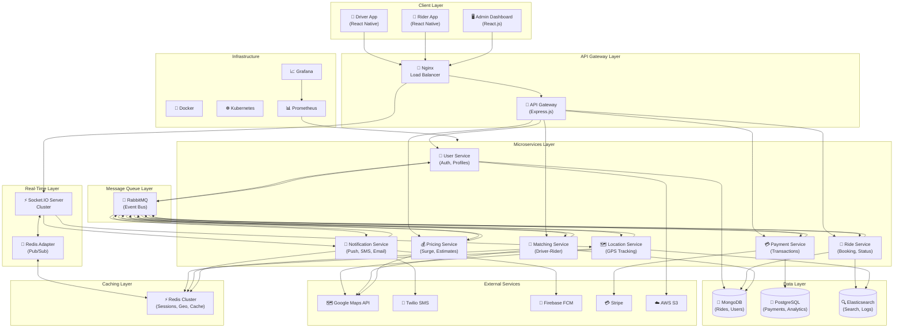
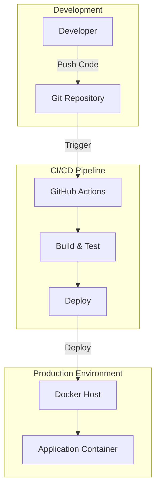

# Architecture Document — VotingFutureWorld

> Generated by Blueprint Brain

**Repository:** SmitVgithub/VotingFutureWorld  
**Language:** nodejs  
**Request:** Create a taxi driver application with a real-time ride sharing.

---

## Architectural Analysis

This taxi driver application with real-time ride sharing requires a robust, scalable architecture designed for high concurrency and low latency. The core challenge is matching drivers with riders in real-time while handling continuous location updates from potentially thousands of concurrent users.

**Architectural Decisions:**

1. **Microservices Architecture**: I've chosen a microservices approach to separate concerns between user management, ride matching, real-time tracking, payments, and notifications. This allows independent scaling of the most demanding services (location tracking and ride matching) without over-provisioning the entire system.

2. **Real-Time Communication with Socket.IO**: WebSockets via Socket.IO provide bidirectional, low-latency communication essential for live location updates, ride status changes, and instant notifications. REST APIs alone cannot meet the sub-second update requirements for a smooth user experience.

3. **Redis for Geospatial Queries**: Redis's GEOADD/GEORADIUS commands provide O(log(N)) complexity for finding nearby drivers, making it ideal for the matching algorithm. Redis also serves as a pub/sub broker for distributing location updates across multiple server instances.

4. **MongoDB for Flexible Data**: The ride-sharing domain has evolving data requirements (surge pricing zones, driver preferences, ride types). MongoDB's schema flexibility accommodates this while providing good read/write performance for ride history and user profiles.

5. **PostgreSQL for Transactions**: Financial data (payments, driver earnings, refunds) requires ACID compliance. PostgreSQL handles this with strong consistency guarantees.

6. **Event-Driven Architecture**: RabbitMQ decouples services and handles spikes in demand. When a ride is requested, events flow through the system asynchronously, improving resilience and allowing services to process at their own pace.

7. **Dual Mobile Apps**: Separate apps for drivers and riders with shared component libraries. React Native enables code sharing while allowing platform-specific optimizations for GPS tracking and background location services.

**Trade-offs Considered:**
- **Socket.IO vs. pure WebSockets**: Socket.IO adds overhead but provides automatic reconnection, room management, and fallback to polling—critical for mobile networks with intermittent connectivity.
- **Redis vs. PostGIS**: PostGIS offers more sophisticated geospatial queries, but Redis's in-memory speed is essential for real-time matching. We use both: Redis for hot data (active drivers) and PostGIS for analytics.
- **Monolith vs. Microservices**: A monolith would be simpler initially, but ride-sharing apps experience highly variable load patterns. The location service might handle 100x more requests than the payment service, making independent scaling crucial.

**Scalability Considerations:**
- Horizontal scaling of Socket.IO servers with Redis adapter for session sharing
- Database read replicas for high-read operations (driver search, ride history)
- CDN for static assets and API response caching where appropriate
- Geographic sharding potential for multi-region deployment

## Summary

This architecture delivers a production-ready taxi/ride-sharing platform using a microservices approach optimized for real-time operations. The system separates concerns across seven core services (User, Ride, Matching, Location, Payment, Notification, Pricing) communicating via RabbitMQ events and Redis pub/sub. Real-time features leverage Socket.IO with Redis adapter for horizontal scaling, while MongoDB handles flexible document storage and PostgreSQL ensures ACID compliance for financial transactions. React Native powers both driver and rider mobile apps with shared component libraries, and a React admin dashboard provides fleet management. The infrastructure uses Docker containers orchestrated by Kubernetes, with comprehensive monitoring via Prometheus and Grafana. This design supports thousands of concurrent users with sub-second location updates and intelligent driver-rider matching.

## System Architecture

## Deployment Architecture

## Component Breakdown

**1. Client Applications:**
- **Driver App (React Native)**: Handles driver availability toggle, ride acceptance/rejection, navigation integration, earnings dashboard, and continuous background location reporting. Uses Mapbox/Google Maps SDK for turn-by-turn navigation.
- **Rider App (React Native)**: Manages ride booking, driver tracking, fare estimation, payment methods, ride history, and ratings. Implements destination prediction and saved places.
- **Admin Dashboard (React.js)**: Provides fleet management, analytics, dispute resolution, surge zone configuration, and driver verification workflows.

**2. API Gateway (Express.js):**
Centralized entry point handling authentication (JWT validation), rate limiting, request logging, and routing to appropriate microservices. Implements circuit breaker pattern for resilience.

**3. Socket.IO Server Cluster:**
Manages persistent WebSocket connections for real-time features. Handles rooms for individual rides (driver + rider), broadcasts location updates, and manages connection state. Redis adapter enables horizontal scaling across multiple instances.

**4. Core Microservices:**
- **User Service**: Registration, authentication (phone OTP + social login), profile management, document verification for drivers, and role-based access control.
- **Ride Service**: Ride lifecycle management (request → match → pickup → in-progress → completed), status transitions, cancellation handling, and ride history.
- **Matching Service**: Core algorithm finding optimal driver-rider pairs based on proximity, driver rating, vehicle type, and estimated pickup time. Uses Redis GEORADIUS for spatial queries.
- **Location Service**: Ingests high-frequency GPS updates (every 3-5 seconds during active rides), stores in Redis for real-time access, and periodically persists to MongoDB for trip reconstruction.
- **Payment Service**: Handles fare calculation, payment processing via Stripe, driver payouts, refunds, and wallet management. Maintains strict ACID compliance with PostgreSQL.
- **Notification Service**: Unified notification dispatch across push (FCM/APNs), SMS (Twilio), and email. Manages notification preferences and delivery tracking.
- **Pricing Service**: Dynamic fare calculation including base fare, distance, time, surge multipliers, and promotions. Integrates with Google Maps Distance Matrix API.

**5. Data Stores:**
- **Redis**: Active driver locations (GEOADD), session management, API response caching, rate limiting counters, and pub/sub for real-time events.
- **MongoDB**: User profiles, ride records, vehicle information, ratings/reviews. Chosen for flexible schema and horizontal scaling.
- **PostgreSQL**: Financial transactions, audit logs, analytics aggregations. Provides ACID guarantees for monetary operations.
- **Elasticsearch**: Full-text search for places, centralized logging, and ride analytics queries.

## Technology Stack

**Backend:**
- **Node.js 20 LTS**: Event-driven, non-blocking I/O ideal for real-time applications with high concurrency
- **Express.js 4.x**: Mature, well-documented web framework with extensive middleware ecosystem
- **Socket.IO 4.x**: Robust WebSocket library with automatic reconnection, rooms, and Redis adapter support
- **TypeScript**: Type safety reduces runtime errors in complex distributed systems

**Databases:**
- **MongoDB 7.x**: Document store for flexible user/ride data with native geospatial indexing
- **PostgreSQL 16**: ACID-compliant relational database for financial transactions
- **Redis 7.x**: In-memory store for caching, geospatial queries (GEORADIUS), and pub/sub
- **Elasticsearch 8.x**: Search engine for place autocomplete and log aggregation

**Message Queue:**
- **RabbitMQ 3.x**: Reliable message broker with dead letter queues, retries, and multiple exchange types

**Mobile:**
- **React Native 0.73**: Cross-platform development with near-native performance
- **Expo**: Simplified build pipeline and OTA updates
- **React Navigation 6**: Native navigation with deep linking support
- **MapLibre/Mapbox**: High-performance maps with custom styling

**Frontend (Admin):**
- **React 18**: Component-based UI with concurrent rendering
- **TanStack Query**: Server state management with caching
- **Recharts**: Data visualization for analytics dashboards
- **Tailwind CSS**: Utility-first styling for rapid development

**Infrastructure:**
- **Docker**: Containerization for consistent environments
- **Kubernetes**: Orchestration for auto-scaling and self-healing
- **Nginx**: Load balancing and SSL termination
- **GitHub Actions**: CI/CD pipeline automation

**External Services:**
- **Google Maps Platform**: Geocoding, directions, distance matrix, places API
- **Stripe**: Payment processing with Connect for driver payouts
- **Twilio**: SMS for OTP and ride notifications
- **Firebase Cloud Messaging**: Push notifications
- **AWS S3**: Document and image storage

## Implementation Phases

**Phase 1: Foundation (Weeks 1-3)**
- Set up monorepo structure with Turborepo/Nx
- Configure Docker development environment
- Implement User Service with phone OTP authentication
- Set up MongoDB and PostgreSQL with initial schemas
- Create basic React Native app shells for driver and rider
- Establish CI/CD pipeline with GitHub Actions

**Phase 2: Core Ride Flow (Weeks 4-6)**
- Implement Ride Service with state machine for ride lifecycle
- Build Matching Service with Redis geospatial queries
- Develop Location Service for GPS tracking
- Create Socket.IO server with Redis adapter
- Integrate Google Maps for geocoding and directions
- Build ride request and acceptance flows in mobile apps

**Phase 3: Real-Time Features (Weeks 7-8)**
- Implement live location tracking during rides
- Build real-time driver availability map for riders
- Add ETA calculations and updates
- Implement ride status push notifications
- Create driver earnings real-time dashboard

**Phase 4: Payments & Pricing (Weeks 9-10)**
- Integrate Stripe for rider payments
- Implement Stripe Connect for driver payouts
- Build Pricing Service with surge pricing logic
- Add fare estimation before ride booking
- Implement wallet and payment method management

**Phase 5: Polish & Scale (Weeks 11-12)**
- Build admin dashboard with fleet management
- Implement rating and review system
- Add ride history and receipts
- Set up Prometheus/Grafana monitoring
- Load testing and performance optimization
- Kubernetes deployment configuration

**Phase 6: Advanced Features (Weeks 13-16)**
- Ride scheduling for future trips
- Ride sharing/pooling algorithm
- Driver document verification workflow
- Promotional codes and referral system
- Multi-language support
- Accessibility improvements

## Risk Analysis

**High Risk:**

1. **Real-Time Scalability**
   - *Risk*: Socket.IO server overwhelmed during peak hours
   - *Mitigation*: Horizontal scaling with Redis adapter, connection pooling, implement backpressure mechanisms, use sticky sessions with Nginx

2. **Location Data Accuracy**
   - *Risk*: GPS drift causing incorrect driver positions and failed matches
   - *Mitigation*: Implement Kalman filtering for location smoothing, validate location updates against expected movement patterns, use multiple location sources (GPS + network)

3. **Payment Failures**
   - *Risk*: Failed charges leaving rides unpaid, driver trust issues
   - *Mitigation*: Pre-authorize payments before ride start, implement retry logic with exponential backoff, maintain payment audit trail, offer multiple payment methods

**Medium Risk:**

4. **Matching Algorithm Fairness**
   - *Risk*: Drivers in certain areas consistently disadvantaged
   - *Mitigation*: Implement fairness metrics, rotate priority among equidistant drivers, provide transparency in matching criteria

5. **Third-Party API Dependencies**
   - *Risk*: Google Maps outage breaking core functionality
   - *Mitigation*: Implement fallback to OpenStreetMap/Mapbox, cache frequently accessed routes, graceful degradation with cached ETAs

6. **Data Consistency**
   - *Risk*: Ride state inconsistencies between services
   - *Mitigation*: Implement saga pattern for distributed transactions, use event sourcing for ride state, add reconciliation jobs

**Low Risk:**

7. **Mobile App Store Rejection**
   - *Risk*: Background location usage flagged by Apple/Google
   - *Mitigation*: Clear privacy policy, proper permission explanations, minimize background location frequency when not on active ride

8. **Database Performance**
   - *Risk*: MongoDB queries slowing as data grows
   - *Mitigation*: Proper indexing strategy, implement data archival for old rides, use read replicas for analytics queries

## Required Secrets & Environment Variables

- `MONGODB_URI` — MongoDB connection string for user and ride data
- `POSTGRES_URL` — PostgreSQL connection string for payment transactions
- `REDIS_URL` — Redis connection string for caching and geospatial data
- `RABBITMQ_URL` — RabbitMQ connection string for event messaging
- `JWT_SECRET` — Secret key for signing JWT authentication tokens
- `JWT_REFRESH_SECRET` — Secret key for refresh tokens
- `GOOGLE_MAPS_API_KEY` — Google Maps Platform API key for geocoding and directions
- `STRIPE_SECRET_KEY` — Stripe secret key for payment processing
- `STRIPE_WEBHOOK_SECRET` — Stripe webhook signing secret
- `TWILIO_ACCOUNT_SID` — Twilio account SID for SMS
- `TWILIO_AUTH_TOKEN` — Twilio authentication token
- `TWILIO_PHONE_NUMBER` — Twilio phone number for sending SMS
- `FIREBASE_SERVICE_ACCOUNT` — Firebase service account JSON for push notifications
- `AWS_ACCESS_KEY_ID` — AWS access key for S3 storage
- `AWS_SECRET_ACCESS_KEY` — AWS secret key for S3 storage
- `AWS_S3_BUCKET` — S3 bucket name for document uploads
- `ELASTICSEARCH_URL` — Elasticsearch connection URL for search and logging

## Next Steps

1. Set up monorepo with Turborepo and configure workspace dependencies
2. Create Docker Compose for local development with all required services (MongoDB, PostgreSQL, Redis, RabbitMQ)
3. Implement User Service with phone OTP authentication using Twilio
4. Build Location Service with Socket.IO and Redis GEOADD for real-time tracking
5. Develop Matching Service algorithm using Redis GEORADIUS for proximity queries
6. Create Ride Service with XState state machine for ride lifecycle management
7. Integrate Google Maps API for geocoding, directions, and ETA calculations
8. Set up Stripe Connect for rider payments and driver payouts
9. Build React Native driver app with background location tracking
10. Build React Native rider app with live map and booking flow
11. Configure Kubernetes deployments with horizontal pod autoscaling
12. Set up Prometheus and Grafana for monitoring and alerting

---
*Generated by Blueprint Brain — Thinks before building.*
